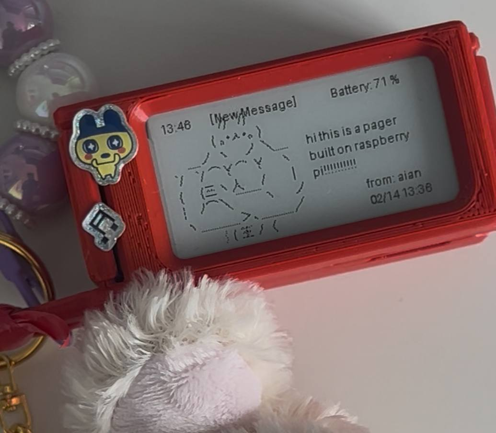

# raspi-pager
Raspi-Pager is a lightweight notification system using a Raspberry Pi with an e-ink display.



## Inspired pwnagotchi hardware:
- Raspberry Pi zero2
- Waveshare v4
- Pisugar3 1200mah


## Getting Started

- Setup Raspberry Pi imager 

- Enable SPI and I2C under "Interface Options" with the command:
```
    sudo raspi-config
```

- Update battery dependencies and download python:
```
    sudo apt update
    sudo apt install python3 python3-venv python3-pip
    wget https://cdn.pisugar.com/release/pisugar-power-manager.sh
    bash pisugar-power-manager.sh -c release
```

- Follow setup guides